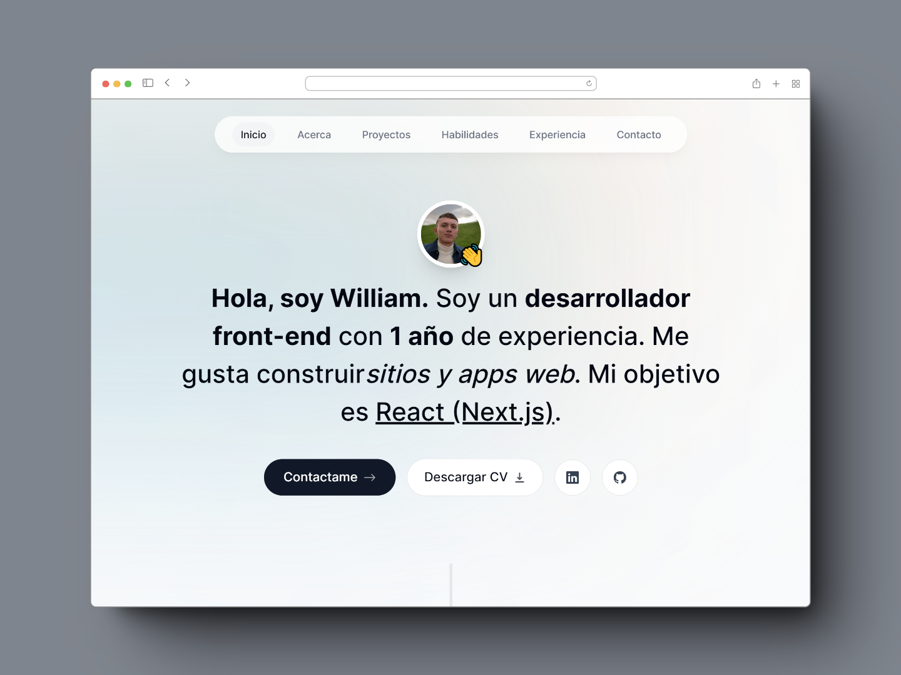

# Portafolio de Desarrollador Front-End

¡Bienvenido a mi portafolio de desarrollador front-end! Soy un apasionado desarrollador autodidacta especializado en React con Next.js. Aquí encontrarás una muestra de mis proyectos y habilidades.

## Sobre Mí
Soy un desarrollador front-end autodidacta con experiencia en creación de interfaces web interactivas y atractivas. Mi enfoque principal es utilizar tecnologías como React y Next.js para construir experiencias de usuario de alta calidad.

## Proyectos Destacados
### 1: Car-hub
Este es un sitio web, desarrollado con next js, consumiendo una api de prueba para obtener información de los vehículos y realizar la reserva.

### 2: Vita-Glow
Es un destino en línea para productos de salud y bienestar.

### 2: Spotify-clon
Creado con tecnologías modernas como Astro y Tailwind CSS, mi clon de Spotify ofrece una experiencia fluida y elegante para los amantes de la música. Con una interfaz intuitiva y animaciones cautivadoras, los usuarios pueden disfrutar de la música que aman mientras exploran nuevas canciones y artistas de manera emocionante y envolvente.

## Buenas Ideas para tu Proyecto
- Implementar animaciones sutiles
- Utilizar componentes reutilizables
- Diseñar un sistema de navegación intuitivo

## Contacto
¡Hablemos sobre tu próximo proyecto! Puedes contactarme a través de:
- Correo Electrónico: calderonwilliam25@gmail.com
- LinkedIn: [William Calderon](https://www.linkedin.com/in/willcalde/)
- GitHub: [Perfil de GitHub](https://github.com/WilliamLop)

## Autor

- Website - [William Calderon](https://porfoliowilliamcl.netlify.app/)
- Frontend Mentor - [@WilliamLop](https://www.frontendmentor.io/profile/WilliamLop)
- Instagram - [@fenbapps](https://www.instagram.com/fenbapps/)

¡Gracias por visitar mi portafolio! Espero que disfrutes explorando mis proyectos y conozcas más sobre mi trabajo.
